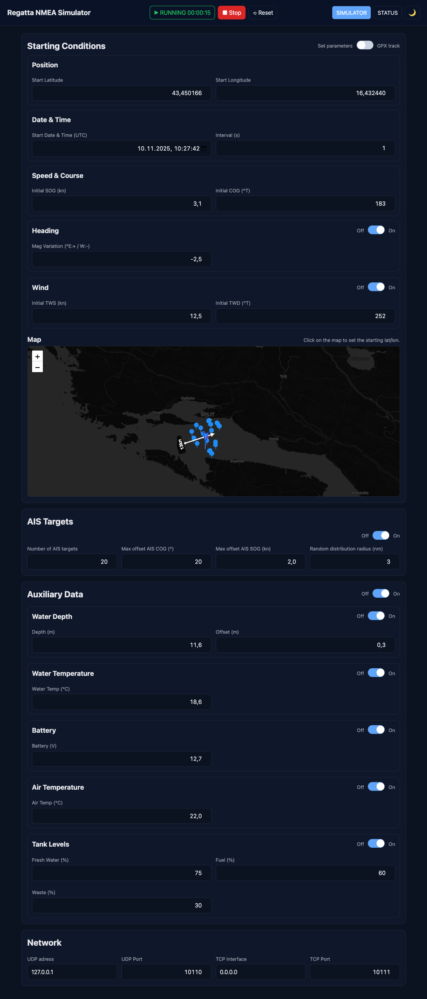
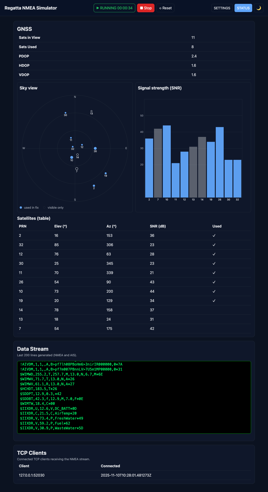
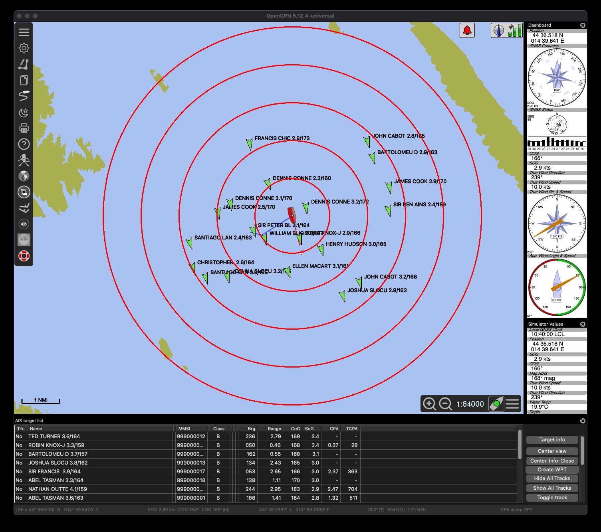

# Regatta NMEA Simulator

A feature-rich NMEA 0183 simulator with a web UI, UDP/TCP output, AIS target simulation, GPX track playback, and live maps with seamarks. Perfect for testing marine navigation applications, chart plotters, and instrument displays.

**Author:** Christian C. Gruber  
**License:** MIT  
**Repository:** [github.com/christiangruber1234/regatta_nmea_simulator](https://github.com/christiangruber1234/regatta_nmea_simulator)

## Table of Contents

- [Screenshots](#screenshots)
- [Features](#features)
- [Requirements](#requirements)
- [Install and run (Web UI)](#install-and-run-web-ui)
- [Install and run (CLI)](#install-and-run-cli)
- [Web UI Overview](#web-ui-overview)
- [REST API](#rest-api)
- [NMEASimulator Class](#nmeasimulator-class)
- [Map Tiles and Themes](#map-tiles-and-themes)
- [Troubleshooting](#troubleshooting)
- [Project Structure](#project-structure)
- [License](#license)
- [Use Cases](#use-cases)
- [Contributing](#contributing)
- [Acknowledgments](#acknowledgments)

## Screenshots

### Simulator Page


### Status Page


### OpenCPN Integration
The simulator works seamlessly with OpenCPN and other marine navigation software. Simply configure your chart plotter or navigation application to listen for NMEA data on UDP port 10110 (or your configured port). The simulator provides realistic GPS position, speed, course, wind data, and AIS targets that appear directly in your navigation software.


*OpenCPN displaying simulated vessel position, track, and AIS targets from the Regatta NMEA Simulator*

## Features

- NMEA output over UDP and TCP
  - GPS/GNSS: GPRMC, GPGGA, GPVTG, GPGSA, GPGSV
  - Wind (optional): WIMWD, WIMWV (True and Apparent)
  - AIS: !AIVDM Type 18 (Class B position) and Type 24 Part A (static data)
  - Heading (optional): HCHDT (true heading derived from COG when enabled)
  - Sensors (optional): Depth (SDDBT, SDDPT), Water Temperature (WIMTW), Battery Voltage (IIXDR), Air Temperature (IIXDR), Tank Levels (IIXDR)
- Realistic simulation: SOG, COG, wind speed/direction, position, and sensor values evolve over time
- AIS targets: configurable count, random spatial distribution, speed/course offsets
- Built-in TCP server to stream the same NMEA payload to multiple clients
- GPX track mode
  - Upload a GPX and play the simulation along the track by time or by index
  - Precise slider preview (time-aligned) and simulator start alignment at the selected position
  - AIS targets follow the GPX with slight offsets for realism
  - Server-side saving of uploaded GPX under `uploads/gpx/`
- Unified header controls on all pages
  - Start / Stop / Restart in the header, centered
  - Live “RUNNING HH:MM:SS” timer and a pulsing green outline while running
- Web UI (Leaflet + OSM + OpenSeaMap)
  - SETTINGS page: network, initial parameters, manual vs GPX mode, wind
  - AIS page: configure AIS targets and visualize them
  - STATUS page: rich GNSS view, TCP clients, and a live NMEA/AIS console
  - Theme toggle (light/dark) switches map tiles; OpenSeaMap seamarks overlay

## Requirements

- Python 3.8+
- Flask (declared in `requirements.txt`)

## Install and run (Web UI)

```bash
python3 -m venv .venv
source .venv/bin/activate  # Windows: .venv\Scripts\activate
pip install -r requirements.txt

# Run the Flask app; default port is 5080. Use PORT to override.
PORT=5080 .venv/bin/python nmea_simulator_flask.py
```

Then open http://localhost:5080 in your browser.

Tip: If port 5080 is already in use on your machine, set a different `PORT`, e.g. `PORT=5090`.

## Install and run (CLI)

You can run the simulator without the web UI. It will send NMEA over UDP only.

```bash
python3 nmea_simulator.py --help
python3 nmea_simulator.py \
  --host 127.0.0.1 \
  --port 10110 \
  --interval 1.0 \
  --wind \
  --lat 42.7157693493 \
  --lon 16.2321737476 \
  --sog 5 --cog 185 --tws 10 --twd 270 --magvar -2.5 \
  --start-datetime 2025-01-01T12:00:00Z
```

Defaults: UDP to 127.0.0.1:10110, 1 Hz.

## Web UI Overview

### Pages

**SIMULATOR** (`/` - `templates/index.html`)
- **Unified Header Controls:** Start/Stop/Reset buttons with live running timer (HH:MM:SS) and animated status indicator
- **Navigation Tabs:** Quick access to SIMULATOR, STATUS, and day/night theme toggle
- **Network Configuration:**
  - UDP destination address (default: 127.0.0.1)
  - UDP port (default: 10110)
  - TCP server interface (default: 0.0.0.0 for all interfaces)
  - TCP server port (default: 10111)
- **Starting Conditions - Toggle between Manual and GPX modes:**
  - **Manual Mode:**
    - Position: Starting latitude/longitude
    - Date & Time: Start datetime (UTC) and interval (seconds)
    - Speed & Course: Initial SOG (knots) and COG (degrees true)
    - Heading: Toggle to enable/disable HCHDT sentence; magnetic variation setting
  - **GPX Mode:**
    - File upload with drag-and-drop support
    - Display uploaded filename and track metadata (points, length, duration)
    - Interactive slider for preview:
      - Time-based (for tracks with timestamps) showing position at specific time
      - Index-based (for tracks without timestamps) showing position by percentage
    - Interval setting applies to both modes
- **Wind Configuration:**
  - Toggle On/Off
  - True Wind Speed (TWS) in knots
  - True Wind Direction (TWD) in degrees true
- **Sensor Configuration** (each with toggle and parameters):
  - **Depth:** Depth in meters and transducer offset
  - **Water Temperature:** Temperature in °C
  - **Battery Voltage:** Voltage in volts
  - **Air Temperature:** Temperature in °C
  - **Tank Levels:** Percentage for FreshWater, Fuel, and WasteWater tanks
- **AIS Configuration:**
  - Number of targets
  - Maximum COG offset (degrees)
  - Maximum SOG offset (knots)
  - Distribution radius (nautical miles)
- **Interactive Map:**
  - Click to set starting position in manual mode
  - Displays GPX track path when uploaded
  - Theme-aware tiles (OSM standard or Carto Dark Matter)
  - OpenSeaMap overlay for nautical features

**STATUS** (`/data` - `templates/data.html`)
- **Header Controls:** Same unified controls
- **Live Simulator Status:**
  - Current position (lat/lon)
  - Speed Over Ground and Course Over Ground
  - Wind data (when enabled)
  - Simulation time
  - Network configuration (UDP/TCP addresses and ports)
- **GNSS Satellite View:**
  - Sky plot showing satellite positions (azimuth/elevation)
  - SNR (Signal-to-Noise Ratio) bar chart for each satellite
  - DOP values (PDOP, HDOP, VDOP)
  - Count of satellites in view vs. used in solution
- **TCP Clients:**
  - List of connected TCP clients with address:port
  - Connection timestamps
  - Auto-updates as clients connect/disconnect
- **Live NMEA/AIS Console:**
  - Scrolling display of last 200 NMEA sentences
  - Real-time updates as data is generated
  - Shows all sentence types (GPRMC, GPGGA, GPVTG, GSA, GSV, wind, AIS, sensors)

## REST API

The simulator provides a comprehensive REST API for programmatic control. See [REST-API.md](REST-API.md) for complete endpoint documentation.

**Available Endpoints:**
- `GET /api/status` - Get current simulator state
- `GET /api/stream` - Retrieve recent NMEA sentences
- `POST /api/start` - Start the simulator with parameters
- `POST /api/stop` - Stop the simulator
- `POST /api/restart` - Restart with new parameters
- `POST /api/upload_gpx` - Upload a GPX track file

## NMEASimulator Class

**Location:** `nmea_simulator.py`

The core simulator class that generates and broadcasts NMEA sentences over UDP and TCP.

### Constructor Parameters

```python
NMEASimulator(
  # Network
  host="127.0.0.1",              # UDP destination address
  port=10110,                    # UDP destination port
  tcp_host="0.0.0.0",            # TCP server bind address (0.0.0.0 = all interfaces)
  tcp_port=10111,                # TCP server port (None to disable)
  
  # Timing
  interval=1.0,                  # Update interval in seconds
  start_datetime=None,           # Starting datetime (UTC), None = use real-time
  
  # Position & Navigation
  start_lat=42.715769,           # Starting latitude (decimal degrees)
  start_lon=16.232174,           # Starting longitude (decimal degrees)
  sog_knots=5.0,                 # Speed Over Ground (knots)
  cog_degrees=185.0,             # Course Over Ground (degrees true)
  mag_variation=-2.5,            # Magnetic variation (degrees, E=+ / W=-)
  
  # Wind (optional)
  wind_enabled=True,             # Enable wind sentences
  tws_knots=10.0,                # True Wind Speed (knots)
  twd_degrees=270.0,             # True Wind Direction (degrees true)
  
  # Heading (optional)
  heading_enabled=False,         # Enable HCHDT sentence (derived from COG)
  
  # Depth (optional)
  depth_enabled=False,           # Enable depth sentences
  depth_m=12.0,                  # Water depth (meters)
  depth_offset_m=0.3,            # Transducer offset (meters)
  
  # Water Temperature (optional)
  water_temp_enabled=False,      # Enable water temp sentence
  water_temp_c=18.0,             # Water temperature (°C)
  
  # Battery (optional)
  battery_enabled=False,         # Enable battery voltage sentence
  battery_v=12.7,                # Battery voltage (volts)
  
  # Air Temperature (optional)
  air_temp_enabled=False,        # Enable air temp sentence
  air_temp_c=23.0,               # Air temperature (°C)
  
  # Tank Levels (optional)
  tanks_enabled=False,           # Enable tank level sentences
  tank_fresh_water=75.0,         # Fresh water tank (%)
  tank_fuel=60.0,                # Fuel tank (%)
  tank_waste=30.0,               # Waste water tank (%)
  
  # AIS
  ais_num_targets=0,             # Number of AIS targets to simulate
  ais_max_cog_offset=20.0,       # Max COG offset for targets (degrees)
  ais_max_sog_offset=2.0,        # Max SOG offset for targets (knots)
  ais_distribution_radius_nm=1.0,# Spatial distribution radius (nautical miles)
  
  # GPX Playback (optional)
  gpx_track=None,                # List of track points [{lat, lon, time}, ...]
  gpx_start_fraction=None,       # Starting fraction (0-1) for tracks without timestamps
)
```

### Methods

- **`start()`** — Starts the background simulation thread and begins emitting NMEA data
- **`stop(timeout=5.0)`** — Stops the simulation thread gracefully with optional timeout
- **`restart(**kwargs)`** — Stops the simulator, updates parameters, and restarts
- **`is_running()`** — Returns True if the simulator is currently running
- **`status()`** — Returns dict with current state:
  - `running`, `host`, `port`, `tcp_host`, `tcp_port`
  - `lat`, `lon`, `sog`, `cog`, `tws`, `twd`, `magvar`
  - `sim_time`, `started_at` (ISO8601 timestamps)
  - `wind_enabled`, `heading_enabled`, sensor enable states
  - Sensor values: `depth_m`, `water_temp_c`, `battery_v`, `air_temp_c`, tank levels
  - `gnss`: satellite data (count, DOP values, individual satellites)
  - `ais`: target count and list of targets with positions/speeds
  - `tcp_clients`: list of connected TCP clients
  - `gpx_track_info`: GPX metadata and playback progress
  - `stream_size`: number of buffered NMEA lines
- **`get_stream(limit=100)`** — Returns list of most recent NMEA sentences (up to limit)

### Output Sentences (per interval tick)

**Core GNSS Sentences (always emitted):**
- `$GPRMC` — Recommended Minimum Navigation Information (time, position, SOG, COG, date, magnetic variation)
- `$GPGGA` — Global Positioning System Fix Data (time, position, fix quality, satellites used, HDOP, altitude)
- `$GPVTG` — Track Made Good and Ground Speed (COG true/magnetic, SOG in knots/km/h)
- `$GPGSA` — DOP and Active Satellites (fix type, PRNs of satellites used, PDOP, HDOP, VDOP)
- `$GPGSV` — Satellites in View (multiple sentences showing PRN, elevation, azimuth, SNR for each satellite)

**Wind Sentences (when `wind_enabled=True`):**
- `$WIMWD` — Wind Direction and Speed (true and magnetic wind direction, speed in knots and m/s)
- `$WIMWV` (True) — Wind Speed and Angle (true wind angle relative to bow, speed)
- `$WIMWV` (Apparent) — Wind Speed and Angle (apparent wind angle, speed)

**Heading Sentence (when `heading_enabled=True`):**
- `$HCHDT` — Heading True (true heading derived from COG)

**Depth Sentences (when `depth_enabled=True`):**
- `$SDDPT` — Depth of Water (depth in meters with transducer offset)
- `$SDDBT` — Depth Below Transducer (depth in feet, meters, and fathoms)

**Environmental Sensor Sentences:**
- `$WIMTW` — Water Temperature (when `water_temp_enabled=True`)
- `$IIXDR` (Voltage) — Battery Voltage (when `battery_enabled=True`)
- `$IIXDR` (Temperature) — Air Temperature (when `air_temp_enabled=True`)
- `$IIXDR` (Volume) — Tank Levels (when `tanks_enabled=True`) - separate sentences for FreshWater, Fuel, WasteWater

**AIS Sentences (when `ais_num_targets > 0`):**
- `!AIVDM` Type 18 — Class B Position Report (for each target, each interval)
- `!AIVDM` Type 24 Part A — Static Data Report (vessel name with embedded SOG/COG, sent once per minute for each target)

### Simulation Behavior

The simulator provides realistic evolution of all parameters:

- **Position:** Updates based on SOG and COG using geodetic calculations
- **SOG/COG:** Random walk variations (±0.2 kn, ±2°) to simulate natural movement
- **Wind:** TWS and TWD vary randomly (±0.3 kn, ±3°) over time
- **Sensors:** All sensor values undergo small random variations to simulate real conditions
- **Tank Levels:** Gradually decrease over time (fresh water and fuel consumed, waste increases)
- **GNSS:** Simulates 8-14 satellites in view with realistic SNR values (20-48 dB), computed DOPs
- **AIS Targets:** 
  - Move independently with offsets from main vessel
  - Follow main vessel in manual mode or GPX track in GPX mode
  - Apply configurable spatial (lateral offset) and speed/course variations
  - Names loaded from `static/skippers.txt` or generated algorithmically

### GPX Track Playback

When a GPX track is loaded:

- **Time-based mode** (tracks with timestamps):
  - Simulator time advances and position is interpolated along the track
  - AIS targets follow with temporal offsets (±30-300 seconds based on track duration)
  - Precise alignment to slider position for accurate preview
  
- **Index-based mode** (tracks without timestamps):
  - Position advances through track points at rate determined by SOG and segment distances
  - AIS targets follow with point index offsets (±50 points)
  - Slider uses fractional position (0.0 to 1.0) along track

- **Automatic SOG/COG calculation:** Derived from segment distances and durations (or distances for non-timed tracks)

## Map Tiles and Themes

The web UI supports day and night themes with appropriate map tile sets:

### Light Theme (Day Mode)
- **Base Layer:** Standard OpenStreetMap tiles
- **Overlay:** OpenSeaMap for nautical features (buoys, lights, depth contours, seamarks)
- **UI:** Light color scheme optimized for daylight viewing

### Dark Theme (Night Mode)
- **Base Layer:** Carto "Dark Matter" tiles (OSM-derived dark theme)
- **Overlay:** OpenSeaMap (same overlay works well with both themes)
- **UI:** Dark color scheme with reduced brightness for night sailing/operation

### Features
- Seamless theme switching via toggle button in navigation bar
- Theme preference persists in browser local storage
- Map tiles automatically swap when theme changes
- Leaflet attribution control hidden for cleaner interface
- All maps include OpenSeaMap overlay with maritime information

**Note:** If redistributing this application, review the terms of service for OpenStreetMap, Carto, and OpenSeaMap tile providers.

## Troubleshooting

### Flask server fails to start
**Error:** "Port 5080 is in use" or "Address already in use"

**Solution:** Run on a different port using the `PORT` environment variable:
```bash
PORT=5090 .venv/bin/python nmea_simulator_flask.py
```

### No NMEA data received by consumer application
**Possible causes:**
1. **Wrong UDP port:** Ensure your consumer listens on the same port as configured (default: 10110)
2. **UDP destination `0.0.0.0`:** The simulator normalizes this to `127.0.0.1`
3. **Firewall blocking:** Local firewall may block UDP/TCP traffic
   - On macOS: Check System Preferences → Security & Privacy → Firewall
   - On Linux: Check `iptables` or `ufw` rules
4. **Wrong network interface:** If sending to remote host, ensure network connectivity

**Debugging:**
```bash
# Listen for UDP packets on port 10110
nc -ul 10110

# Or use tcpdump
sudo tcpdump -i lo0 -n udp port 10110 -A
```

### TCP clients can't connect
**Possible causes:**
1. **TCP server disabled:** Ensure `tcp_port` is set to a valid port number (not 0 or null)
2. **Wrong interface:** `tcp_host` must be reachable from client
   - `0.0.0.0` = all interfaces (recommended for external clients)
   - `127.0.0.1` = localhost only
3. **Firewall blocking:** Check firewall rules for TCP port (default: 10111)

**Testing TCP connection:**
```bash
# Test connection to TCP server
telnet localhost 10111

# Or use netcat
nc localhost 10111
```

### GPX file upload fails
**Possible causes:**
1. **Invalid XML:** GPX file must be valid XML
2. **Missing track points:** GPX must contain at least 2 track points
3. **File size:** Very large GPX files may timeout (adjust Flask settings if needed)

**Verification:**
- Check GPX file is valid XML and follows GPX 1.0/1.1 schema
- Ensure `<trkpt>` elements have `lat` and `lon` attributes

### AIS targets not appearing
**Possible causes:**
1. **AIS target count set to 0:** Check AIS configuration and set `ais_num_targets > 0`
2. **Distribution radius too small:** Targets may be very close to main vessel
3. **Map zoom level:** Zoom out to see targets distributed around main vessel

### Simulation not starting
**Check browser console** (F12) for JavaScript errors

**Check Flask logs** for Python exceptions

**Verify status:**
```bash
curl http://localhost:5080/api/status
```

## Project Structure

```
regatta_nmea_simulator/
├── nmea_simulator.py              # Core NMEASimulator class and CLI entry point
├── nmea_simulator_flask.py        # Flask web server with REST API
├── requirements.txt               # Python dependencies (Flask)
├── README.md                      # This file
├── templates/                     # Jinja2 HTML templates
│   ├── index.html                 # Main SIMULATOR page
│   └── data.html                  # STATUS page with live data
├── static/                        # Static assets (CSS, JavaScript, data)
│   ├── css/
│   │   └── styles.css             # Complete application styling
│   ├── js/
│   │   ├── regatta_nmea_simulator.js  # Main page logic (map, GPX, controls)
│   │   ├── header_controls.js     # Shared header controls across pages
│   │   └── app.js                 # Additional shared functionality
│   └── skippers.txt               # List of vessel/skipper names for AIS
├── uploads/                       # Created at runtime
│   └── gpx/                       # Uploaded GPX files stored here
└── __pycache__/                   # Python bytecode cache

Key Files:
- nmea_simulator.py: 1200+ lines, pure Python NMEA generator with threading
- nmea_simulator_flask.py: Flask routes, API endpoints, GPX processing
- static/js/regatta_nmea_simulator.js: 1200+ lines, main UI logic
- templates/index.html: 350+ lines, main simulator interface
```

### Component Responsibilities

**nmea_simulator.py**
- NMEA sentence generation (all types: GNSS, wind, sensors, AIS)
- Simulation logic (position updates, random variations)
- UDP and TCP networking
- GPX track playback
- AIS target management
- Thread-safe status reporting

**nmea_simulator_flask.py**
- Flask application setup and routing
- REST API implementation
- GPX file upload and parsing
- Coordinate system transformations
- Session management

**Static Assets**
- `regatta_nmea_simulator.js`: Map initialization, user input handling, API communication
- `header_controls.js`: Start/Stop/Reset buttons, running timer, status polling
- `styles.css`: Complete styling including themes, animations, responsive layout
- `skippers.txt`: Realistic vessel names for AIS simulation

## License

MIT License

Copyright © 2025 Christian C. Gruber

Permission is hereby granted, free of charge, to any person obtaining a copy of this software and associated documentation files (the "Software"), to deal in the Software without restriction, including without limitation the rights to use, copy, modify, merge, publish, distribute, sublicense, and/or sell copies of the Software, and to permit persons to whom the Software is furnished to do so, subject to the following conditions:

The above copyright notice and this permission notice shall be included in all copies or substantial portions of the Software.

THE SOFTWARE IS PROVIDED "AS IS", WITHOUT WARRANTY OF ANY KIND, EXPRESS OR IMPLIED, INCLUDING BUT NOT LIMITED TO THE WARRANTIES OF MERCHANTABILITY, FITNESS FOR A PARTICULAR PURPOSE AND NONINFRINGEMENT. IN NO EVENT SHALL THE AUTHORS OR COPYRIGHT HOLDERS BE LIABLE FOR ANY CLAIM, DAMAGES OR OTHER LIABILITY, WHETHER IN AN ACTION OF CONTRACT, TORT OR OTHERWISE, ARISING FROM, OUT OF OR IN CONNECTION WITH THE SOFTWARE OR THE USE OR OTHER DEALINGS IN THE SOFTWARE.

---

## Use Cases

This simulator is ideal for:

- **Marine Software Development:** Test navigation apps, chart plotters, and instrument displays without needing physical devices or being on the water
- **Integration Testing:** Validate NMEA 0183 parsing and data handling in marine electronics projects
- **Education:** Learn about NMEA protocols, GPS/GNSS systems, AIS, and marine navigation
- **UI/UX Design:** Develop and test user interfaces for marine applications with realistic data streams
- **Fleet Simulation:** Test multi-vessel scenarios with configurable AIS targets
- **Route Planning:** Simulate GPX tracks to verify routing algorithms and navigation logic
- **Demo and Training:** Demonstrate marine software capabilities with realistic, controllable data

## Contributing

Contributions are welcome! Please feel free to submit issues, feature requests, or pull requests on GitHub.

**Repository:** [github.com/christiangruber1234/regatta_nmea_simulator](https://github.com/christiangruber1234/regatta_nmea_simulator)

## Acknowledgments

- OpenStreetMap contributors for map tiles
- Carto for Dark Matter theme tiles
- OpenSeaMap for nautical overlay data
- Leaflet.js for mapping library
- Flask framework for web backend
- The initial simulator code was forked from Christian Heiling's repository: [github.com/heilingch/polar_performance](https://github.com/heilingch/polar_performance)

---

**Note:** The initial simulator code was forked from Christian Heiling's repository: [github.com/heilingch/polar_performance](https://github.com/heilingch/polar_performance)
